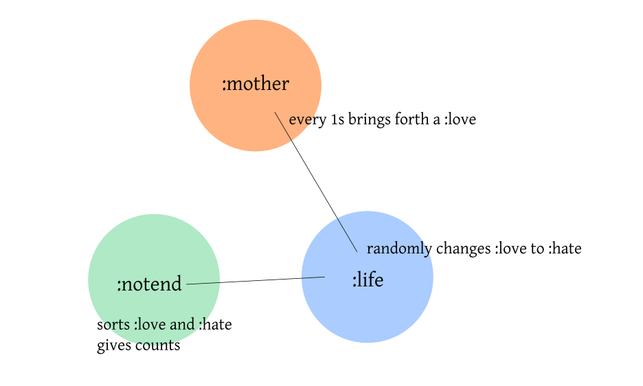

# Lovehate

Getting back to Elixir :-) Toying with potions. Next stop? GenServers! :)~~

## Installation

If [available in Hex](https://hex.pm/docs/publish), the package can be installed
by adding `lovehate` to your list of dependencies in `mix.exs`:

```elixir
def deps do
  [
    {:lovehate, "~> 0.1.0"}
  ]
end
```

Documentation can be generated with [ExDoc](https://github.com/elixir-lang/ex_doc)
and published on [HexDocs](https://hexdocs.pm). Once published, the docs can
be found at [https://hexdocs.pm/lovehate](https://hexdocs.pm/lovehate).

## GenServers Design


